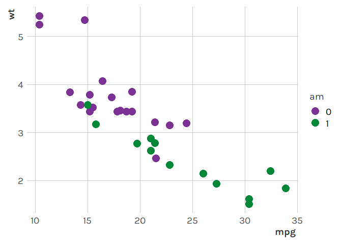
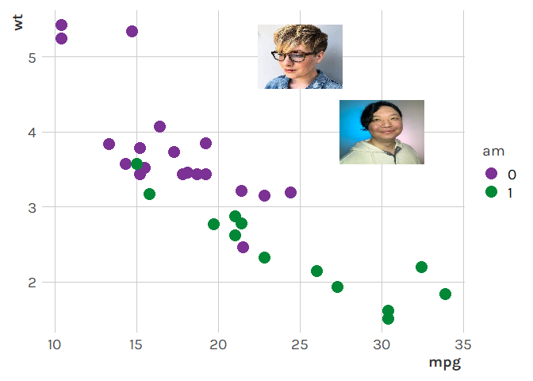

<!-- README.md is generated from README.Rmd. Please edit that file -->

# tonythemes

<!-- badges: start -->

[](https://lifecycle.r-lib.org/articles/stages.html#experimental)

<!-- badges: end -->

`{tonythemes}` is a package that I use for custom themes.

## Installation

You can install the development version of `{tonythemes}` from
[GitHub](https://github.com/) with:

``` r
# install.packages('remotes')
remotes::install_github('tonyelhabr/tonythemes')
```

## Usage

``` r
library(tidyverse)
#> -- Attaching packages --------------------------------------- tidyverse 1.3.0 --
#> v ggplot2 3.3.3     v purrr   0.3.4
#> v tibble  3.1.0     v dplyr   1.0.6
#> v tidyr   1.1.3     v stringr 1.4.0
#> v readr   1.4.0     v forcats 0.5.1
#> Warning: package 'ggplot2' was built under R version 4.0.3
#> Warning: package 'tibble' was built under R version 4.0.4
#> Warning: package 'tidyr' was built under R version 4.0.5
#> Warning: package 'readr' was built under R version 4.0.3
#> Warning: package 'dplyr' was built under R version 4.0.5
#> -- Conflicts ------------------------------------------ tidyverse_conflicts() --
#> x dplyr::filter() masks stats::filter()
#> x dplyr::lag()    masks stats::lag()
library(tonythemes)
pal <- palette_sliced(5)[c(1, 5)]
p <-
  mtcars %>%
  mutate(across(am, factor)) %>%
  ggplot() +
  aes(x = mpg, y = wt) +
  geom_point(aes(color = am), size = 5) +
  scale_color_manual(values = pal) +
  theme_tony()
p
```



``` r
p +
  annotate_nickwan(x = 30, y = 4, size = 0.2) +
  annotate_megrisdal(x = 25, y = 5, size = 0.2)
```


